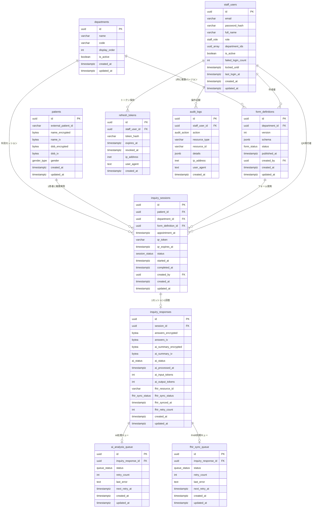

# DB定義書 / ER図
## デジタル問診システム (Medical Inquiry System)

| 項目 | 内容 |
|------|------|
| 文書バージョン | 1.0.0 |
| 作成日 | 2026-03-28 |
| DBMS | PostgreSQL 16 |
| 文字コード | UTF-8 |
| タイムゾーン | Asia/Tokyo（TIMESTAMPTZ で UTC 保存・アプリ側で JST 変換） |

---

## 目次

1. [ER図](#1-er図)
2. [ENUM型定義](#2-enum型定義)
3. [テーブル定義](#3-テーブル定義)
   - [departments（診療科）](#31-departments-診療科)
   - [form_definitions（フォーム定義）](#32-form_definitions-フォーム定義)
   - [patients（患者）](#33-patients-患者)
   - [inquiry_sessions（問診セッション）](#34-inquiry_sessions-問診セッション)
   - [inquiry_responses（問診回答）](#35-inquiry_responses-問診回答)
   - [staff_users（スタッフアカウント）](#36-staff_users-スタッフアカウント)
   - [refresh_tokens（リフレッシュトークン）](#37-refresh_tokens-リフレッシュトークン)
   - [ai_analysis_queue（AI分析キュー）](#38-ai_analysis_queue-ai分析キュー)
   - [fhir_sync_queue（FHIR同期キュー）](#39-fhir_sync_queue-fhir同期キュー)
   - [audit_logs（監査ログ）](#310-audit_logs-監査ログ)
4. [インデックス定義](#4-インデックス定義)
5. [制約・ポリシー定義](#5-制約ポリシー定義)
6. [暗号化設計](#6-暗号化設計)
7. [パーティショニング・アーカイブ方針](#7-パーティショニングアーカイブ方針)
8. [データ量見積もり](#8-データ量見積もり)

---

## 1. ER図



---

## 2. ENUM型定義

### 2.1 gender_type（性別）

```sql
CREATE TYPE gender_type AS ENUM (
    'male',    -- 男性
    'female',  -- 女性
    'other'    -- その他・回答しない
);
```

### 2.2 staff_role（スタッフロール）

```sql
CREATE TYPE staff_role AS ENUM (
    'admin',      -- システム管理者
    'doctor',     -- 医師
    'nurse',      -- 看護師
    'reception'   -- 受付スタッフ
);
```

### 2.3 form_status（フォーム状態）

```sql
CREATE TYPE form_status AS ENUM (
    'draft',      -- ドラフト（編集中）
    'published',  -- 公開中（患者向けに使用）
    'archived'    -- アーカイブ（旧バージョン）
);
```

### 2.4 session_status（問診セッション状態）

```sql
CREATE TYPE session_status AS ENUM (
    'pending',      -- QR発行済み・未開始
    'in_progress',  -- 記入中
    'completed',    -- 回答送信完了
    'cancelled',    -- キャンセル（受付スタッフが手動で操作）
    'expired'       -- QRトークン有効期限切れ
);
```

### 2.5 ai_status（AI分析状態）

```sql
CREATE TYPE ai_status AS ENUM (
    'pending',    -- 分析待ち
    'processing', -- Claude API呼び出し中
    'completed',  -- 分析完了
    'failed',     -- 分析失敗（リトライ上限超過）
    'skipped'     -- AI同意なし等でスキップ
);
```

### 2.6 fhir_sync_status（FHIR同期状態）

```sql
CREATE TYPE fhir_sync_status AS ENUM (
    'pending',    -- 同期待ち
    'syncing',    -- 同期中
    'synced',     -- 同期完了
    'failed'      -- 同期失敗（リトライ上限超過）
);
```

### 2.7 queue_status（キュー状態）

```sql
CREATE TYPE queue_status AS ENUM (
    'pending',    -- 実行待ち
    'processing', -- 実行中
    'completed',  -- 完了
    'failed'      -- 失敗（上限到達）
);
```

### 2.8 audit_action（監査アクション種別）

```sql
CREATE TYPE audit_action AS ENUM (
    'read',          -- データ参照
    'create',        -- データ作成
    'update',        -- データ更新
    'delete',        -- データ削除
    'export',        -- PDF出力・データエクスポート
    'login',         -- ログイン成功
    'logout',        -- ログアウト
    'login_failed',  -- ログイン失敗
    'qr_issued',     -- QRコード発行
    'form_published' -- フォーム公開
);
```

---

## 3. テーブル定義

### 3.1 departments（診療科）

診療科のマスタテーブル。フォーム定義・問診セッションの親となる。

```sql
CREATE TABLE departments (
    id            UUID         PRIMARY KEY DEFAULT gen_random_uuid(),
    name          VARCHAR(100) NOT NULL,                    -- 診療科名（例: 内科）
    code          VARCHAR(50)  NOT NULL,                    -- 識別コード（例: naika）
    display_order INT          NOT NULL DEFAULT 0,          -- 表示順
    is_active     BOOLEAN      NOT NULL DEFAULT TRUE,       -- 有効フラグ
    created_at    TIMESTAMPTZ  NOT NULL DEFAULT NOW(),
    updated_at    TIMESTAMPTZ  NOT NULL DEFAULT NOW(),

    CONSTRAINT uq_departments_code UNIQUE (code)
);

COMMENT ON TABLE  departments              IS '診療科マスタ';
COMMENT ON COLUMN departments.code        IS '診療科の識別コード（URLパラメータ等に使用）';
COMMENT ON COLUMN departments.is_active   IS 'FALSE にすると問診フォームから非表示になる';
```

| カラム名 | データ型 | NULL | デフォルト | 説明 |
|---------|---------|------|-----------|------|
| id | UUID | NOT NULL | gen_random_uuid() | サロゲートキー |
| name | VARCHAR(100) | NOT NULL | - | 診療科名（例: 内科、外科・整形外科） |
| code | VARCHAR(50) | NOT NULL | - | 識別コード（例: naika、geka）※UNIQUE |
| display_order | INT | NOT NULL | 0 | UI表示順 |
| is_active | BOOLEAN | NOT NULL | TRUE | 無効化フラグ（削除はしない） |
| created_at | TIMESTAMPTZ | NOT NULL | NOW() | 作成日時 |
| updated_at | TIMESTAMPTZ | NOT NULL | NOW() | 更新日時 |

**初期データ（マスタ）**

| code | name | display_order |
|------|------|--------------|
| naika | 内科 | 1 |
| geka | 外科・整形外科 | 2 |
| sanka_fujinka | 産婦人科 | 3 |
| shonika | 小児科 | 4 |

---

### 3.2 form_definitions（フォーム定義）

診療科ごとの問診フォーム定義。バージョン管理あり。

```sql
CREATE TABLE form_definitions (
    id            UUID        PRIMARY KEY DEFAULT gen_random_uuid(),
    department_id UUID        NOT NULL REFERENCES departments(id),
    version       INT         NOT NULL,                      -- 1から始まる連番
    schema        JSONB       NOT NULL,                      -- 質問・分岐ロジック定義
    status        form_status NOT NULL DEFAULT 'draft',
    published_at  TIMESTAMPTZ,                               -- 公開日時（NULL = 未公開）
    created_by    UUID        NOT NULL REFERENCES staff_users(id),
    created_at    TIMESTAMPTZ NOT NULL DEFAULT NOW(),
    updated_at    TIMESTAMPTZ NOT NULL DEFAULT NOW(),

    CONSTRAINT uq_form_definitions_dept_version UNIQUE (department_id, version),
    -- 各診療科に公開中のフォームは1つのみ
    CONSTRAINT uq_form_definitions_dept_published
        EXCLUDE USING btree (department_id WITH =)
        WHERE (status = 'published')
);

COMMENT ON TABLE  form_definitions         IS '診療科別問診フォーム定義（バージョン管理）';
COMMENT ON COLUMN form_definitions.schema  IS 'JSON Schema形式の質問定義・分岐ロジック。詳細はdocs/form-schema.mdを参照';
COMMENT ON COLUMN form_definitions.version IS '診療科ごとに1から連番採番';
```

| カラム名 | データ型 | NULL | デフォルト | 説明 |
|---------|---------|------|-----------|------|
| id | UUID | NOT NULL | gen_random_uuid() | サロゲートキー |
| department_id | UUID | NOT NULL | - | FK → departments.id |
| version | INT | NOT NULL | - | バージョン番号（診療科ごと連番） |
| schema | JSONB | NOT NULL | - | フォーム定義JSON（質問・分岐・バリデーション） |
| status | form_status | NOT NULL | 'draft' | draft / published / archived |
| published_at | TIMESTAMPTZ | NULL | - | 公開日時 |
| created_by | UUID | NOT NULL | - | FK → staff_users.id（作成した管理者） |
| created_at | TIMESTAMPTZ | NOT NULL | NOW() | 作成日時 |
| updated_at | TIMESTAMPTZ | NOT NULL | NOW() | 更新日時 |

**schema フィールドの構造例**

```jsonc
{
  "title": "内科問診票 v3",
  "sections": [
    {
      "id": "chief_complaint",
      "title": "主訴・症状",
      "questions": [
        {
          "id": "q_fever",
          "type": "radio",          // radio | checkbox | text | number | date | scale | body_map | photo
          "label": "発熱はありますか？",
          "required": true,
          "options": ["はい", "いいえ"],
          "branches": [
            {
              "condition": { "operator": "eq", "value": "はい" },
              "show_questions": ["q_max_temp", "q_antipyretic"]
            }
          ]
        },
        {
          "id": "q_max_temp",
          "type": "number",
          "label": "最高体温（℃）",
          "required": true,
          "validation": { "min": 35.0, "max": 42.0 },
          "visible_by_default": false
        }
      ]
    }
  ]
}
```

---

### 3.3 patients（患者）

患者情報。個人識別情報は全て暗号化。

```sql
CREATE TABLE patients (
    id                   UUID        PRIMARY KEY DEFAULT gen_random_uuid(),
    external_patient_id  VARCHAR(100),                    -- NEC MegaOakHRの患者ID
    name_encrypted       BYTEA       NOT NULL,            -- 氏名（AES-256-GCM暗号化）
    name_iv              BYTEA       NOT NULL,            -- 氏名暗号化のIV（12バイト）
    dob_encrypted        BYTEA       NOT NULL,            -- 生年月日（AES-256-GCM暗号化）
    dob_iv               BYTEA       NOT NULL,            -- 生年月日暗号化のIV
    gender               gender_type NOT NULL,
    created_at           TIMESTAMPTZ NOT NULL DEFAULT NOW(),
    updated_at           TIMESTAMPTZ NOT NULL DEFAULT NOW()
);

COMMENT ON TABLE  patients                      IS '患者情報。個人識別情報はAES-256-GCMで暗号化して保存';
COMMENT ON COLUMN patients.external_patient_id  IS 'NEC MegaOakHRの患者ID。FHIR Patient リソースの参照に使用';
COMMENT ON COLUMN patients.name_encrypted       IS '氏名の暗号化バイト列。AWS KMSで管理するキーで復号';
COMMENT ON COLUMN patients.name_iv              IS 'GCMモードの初期化ベクタ（96bit = 12バイト）';
```

| カラム名 | データ型 | NULL | デフォルト | 説明 |
|---------|---------|------|-----------|------|
| id | UUID | NOT NULL | gen_random_uuid() | サロゲートキー |
| external_patient_id | VARCHAR(100) | NULL | - | NEC MegaOakHR患者ID（FHIR連携用） |
| name_encrypted | BYTEA | NOT NULL | - | 氏名（AES-256-GCM暗号化） |
| name_iv | BYTEA | NOT NULL | - | 暗号化IV（12バイト固定） |
| dob_encrypted | BYTEA | NOT NULL | - | 生年月日（AES-256-GCM暗号化） |
| dob_iv | BYTEA | NOT NULL | - | 暗号化IV（12バイト固定） |
| gender | gender_type | NOT NULL | - | 性別（male / female / other） |
| created_at | TIMESTAMPTZ | NOT NULL | NOW() | 初回来院・問診時に作成 |
| updated_at | TIMESTAMPTZ | NOT NULL | NOW() | 更新日時 |

---

### 3.4 inquiry_sessions（問診セッション）

QRコード発行から問診完了までの1問診トランザクション。

```sql
CREATE TABLE inquiry_sessions (
    id                 UUID           PRIMARY KEY DEFAULT gen_random_uuid(),
    patient_id         UUID           NOT NULL REFERENCES patients(id),
    department_id      UUID           NOT NULL REFERENCES departments(id),
    form_definition_id UUID           NOT NULL REFERENCES form_definitions(id),
    appointment_at     TIMESTAMPTZ    NOT NULL,            -- 予約日時
    qr_token           VARCHAR(36)    NOT NULL,            -- UUID v4形式
    qr_expires_at      TIMESTAMPTZ    NOT NULL,            -- QR有効期限（予約日翌日0時）
    status             session_status NOT NULL DEFAULT 'pending',
    started_at         TIMESTAMPTZ,                        -- 患者が問診を開始した日時
    completed_at       TIMESTAMPTZ,                        -- 問診回答を送信した日時
    created_by         UUID           NOT NULL REFERENCES staff_users(id),
    created_at         TIMESTAMPTZ    NOT NULL DEFAULT NOW(),
    updated_at         TIMESTAMPTZ    NOT NULL DEFAULT NOW(),

    CONSTRAINT uq_inquiry_sessions_qr_token UNIQUE (qr_token),
    -- 同一患者の同一予約日に同一診療科のセッションは1つのみ
    CONSTRAINT uq_inquiry_sessions_patient_dept_date
        UNIQUE (patient_id, department_id, appointment_at)
);

COMMENT ON TABLE  inquiry_sessions              IS '問診セッション。QRコード発行から回答完了までのライフサイクルを管理';
COMMENT ON COLUMN inquiry_sessions.qr_token     IS 'UUID v4。Redisにもミラーして高速検証。使用後・期限切れは expired に更新';
COMMENT ON COLUMN inquiry_sessions.qr_expires_at IS '予約日当日の翌日0時（Asia/Tokyo）を UTC で保存';
```

| カラム名 | データ型 | NULL | デフォルト | 説明 |
|---------|---------|------|-----------|------|
| id | UUID | NOT NULL | gen_random_uuid() | サロゲートキー |
| patient_id | UUID | NOT NULL | - | FK → patients.id |
| department_id | UUID | NOT NULL | - | FK → departments.id |
| form_definition_id | UUID | NOT NULL | - | FK → form_definitions.id（発行時点の公開バージョン） |
| appointment_at | TIMESTAMPTZ | NOT NULL | - | 予約日時 |
| qr_token | VARCHAR(36) | NOT NULL | - | UUID v4トークン（UNIQUE） |
| qr_expires_at | TIMESTAMPTZ | NOT NULL | - | QR有効期限 |
| status | session_status | NOT NULL | 'pending' | pending / in_progress / completed / cancelled / expired |
| started_at | TIMESTAMPTZ | NULL | - | 患者がQRスキャンして問診を開始した日時 |
| completed_at | TIMESTAMPTZ | NULL | - | 問診回答送信日時 |
| created_by | UUID | NOT NULL | - | FK → staff_users.id（QR発行者） |
| created_at | TIMESTAMPTZ | NOT NULL | NOW() | セッション作成日時 |
| updated_at | TIMESTAMPTZ | NOT NULL | NOW() | 更新日時 |

**ステータス遷移図**

```
[QR発行]
    │
    ▼
 pending ──（有効期限切れ）──→ expired
    │
    │ QRスキャン
    ▼
in_progress ──（受付が手動操作）──→ cancelled
    │
    │ 患者が送信
    ▼
completed
```

---

### 3.5 inquiry_responses（問診回答）

患者の問診回答本体。1セッションに1レコード（UNIQUE）。

```sql
CREATE TABLE inquiry_responses (
    id                   UUID             PRIMARY KEY DEFAULT gen_random_uuid(),
    session_id           UUID             NOT NULL REFERENCES inquiry_sessions(id),
    answers_encrypted    BYTEA            NOT NULL,   -- 全回答JSON（AES-256-GCM暗号化）
    answers_iv           BYTEA            NOT NULL,
    ai_summary_encrypted BYTEA,                       -- AIサマリーJSON（暗号化）
    ai_summary_iv        BYTEA,
    ai_status            ai_status        NOT NULL DEFAULT 'pending',
    ai_processed_at      TIMESTAMPTZ,                 -- AIサマリー生成完了日時
    ai_input_tokens      INT,                         -- Claude API入力トークン数
    ai_output_tokens     INT,                         -- Claude API出力トークン数
    fhir_resource_id     VARCHAR(200),                -- MegaOakHR側のFHIRリソースID
    fhir_sync_status     fhir_sync_status NOT NULL DEFAULT 'pending',
    fhir_synced_at       TIMESTAMPTZ,                 -- FHIR同期完了日時
    fhir_retry_count     INT              NOT NULL DEFAULT 0,
    created_at           TIMESTAMPTZ      NOT NULL DEFAULT NOW(),
    updated_at           TIMESTAMPTZ      NOT NULL DEFAULT NOW(),

    CONSTRAINT uq_inquiry_responses_session UNIQUE (session_id),
    CONSTRAINT chk_ai_summary_both_or_none
        CHECK (
            (ai_summary_encrypted IS NULL AND ai_summary_iv IS NULL) OR
            (ai_summary_encrypted IS NOT NULL AND ai_summary_iv IS NOT NULL)
        ),
    CONSTRAINT chk_fhir_retry_count CHECK (fhir_retry_count >= 0 AND fhir_retry_count <= 3)
);

COMMENT ON TABLE  inquiry_responses                   IS '問診回答本体。個人情報を含む回答は全て暗号化して保存';
COMMENT ON COLUMN inquiry_responses.answers_encrypted IS '問診全回答をJSON化してAES-256-GCMで暗号化したバイト列';
COMMENT ON COLUMN inquiry_responses.ai_input_tokens   IS 'コスト管理・監査のためClaude APIトークン数を記録';
COMMENT ON COLUMN inquiry_responses.fhir_retry_count  IS 'FHIR同期失敗時のリトライ回数。3回失敗でfailed確定';
```

| カラム名 | データ型 | NULL | デフォルト | 説明 |
|---------|---------|------|-----------|------|
| id | UUID | NOT NULL | gen_random_uuid() | サロゲートキー |
| session_id | UUID | NOT NULL | - | FK → inquiry_sessions.id（UNIQUE） |
| answers_encrypted | BYTEA | NOT NULL | - | 全回答JSON暗号化 |
| answers_iv | BYTEA | NOT NULL | - | 暗号化IV |
| ai_summary_encrypted | BYTEA | NULL | - | AIサマリーJSON暗号化（生成前はNULL） |
| ai_summary_iv | BYTEA | NULL | - | 暗号化IV |
| ai_status | ai_status | NOT NULL | 'pending' | AI分析状態 |
| ai_processed_at | TIMESTAMPTZ | NULL | - | AI分析完了日時 |
| ai_input_tokens | INT | NULL | - | Claude API入力トークン数（コスト管理用） |
| ai_output_tokens | INT | NULL | - | Claude API出力トークン数 |
| fhir_resource_id | VARCHAR(200) | NULL | - | MegaOakHRのFHIR QuestionnaireResponse ID |
| fhir_sync_status | fhir_sync_status | NOT NULL | 'pending' | FHIR同期状態 |
| fhir_synced_at | TIMESTAMPTZ | NULL | - | FHIR同期完了日時 |
| fhir_retry_count | INT | NOT NULL | 0 | FHIR同期リトライ回数（最大3） |
| created_at | TIMESTAMPTZ | NOT NULL | NOW() | 回答送信日時 |
| updated_at | TIMESTAMPTZ | NOT NULL | NOW() | 更新日時 |

---

### 3.6 staff_users（スタッフアカウント）

病院スタッフのアカウント情報。

```sql
CREATE TABLE staff_users (
    id                  UUID        PRIMARY KEY DEFAULT gen_random_uuid(),
    email               VARCHAR(254) NOT NULL,
    password_hash       VARCHAR(72)  NOT NULL,            -- bcrypt（コスト係数12）
    full_name           VARCHAR(100) NOT NULL,
    role                staff_role   NOT NULL,
    department_ids      UUID[]       NOT NULL DEFAULT '{}', -- 担当診療科（複数可）
    is_active           BOOLEAN      NOT NULL DEFAULT TRUE,
    failed_login_count  INT          NOT NULL DEFAULT 0,
    locked_until        TIMESTAMPTZ,                      -- アカウントロック解除日時
    last_login_at       TIMESTAMPTZ,
    created_at          TIMESTAMPTZ  NOT NULL DEFAULT NOW(),
    updated_at          TIMESTAMPTZ  NOT NULL DEFAULT NOW(),

    CONSTRAINT uq_staff_users_email UNIQUE (email),
    CONSTRAINT chk_staff_users_failed_count CHECK (failed_login_count >= 0 AND failed_login_count <= 10),
    CONSTRAINT chk_staff_users_email_format CHECK (email ~* '^[A-Za-z0-9._%+-]+@[A-Za-z0-9.-]+\.[A-Za-z]{2,}$')
);

COMMENT ON TABLE  staff_users                   IS '病院スタッフアカウント。患者は含まない';
COMMENT ON COLUMN staff_users.password_hash     IS 'bcrypt ハッシュ。コスト係数12推奨';
COMMENT ON COLUMN staff_users.department_ids    IS 'admin は全科アクセス可のため空配列でもよい。doctor/nurse は担当科のみ';
COMMENT ON COLUMN staff_users.locked_until      IS 'ログイン失敗5回でNOW()+30分をセット。NULL または過去日時なら非ロック';
```

| カラム名 | データ型 | NULL | デフォルト | 説明 |
|---------|---------|------|-----------|------|
| id | UUID | NOT NULL | gen_random_uuid() | サロゲートキー |
| email | VARCHAR(254) | NOT NULL | - | ログインID（UNIQUE） |
| password_hash | VARCHAR(72) | NOT NULL | - | bcryptハッシュ（コスト係数12） |
| full_name | VARCHAR(100) | NOT NULL | - | 氏名（表示用） |
| role | staff_role | NOT NULL | - | admin / doctor / nurse / reception |
| department_ids | UUID[] | NOT NULL | '{}' | 担当診療科ID配列 |
| is_active | BOOLEAN | NOT NULL | TRUE | 退職者はFALSEにして論理削除 |
| failed_login_count | INT | NOT NULL | 0 | 連続ログイン失敗回数 |
| locked_until | TIMESTAMPTZ | NULL | - | ロック解除日時（NULL=非ロック） |
| last_login_at | TIMESTAMPTZ | NULL | - | 最終ログイン日時 |
| created_at | TIMESTAMPTZ | NOT NULL | NOW() | アカウント作成日時 |
| updated_at | TIMESTAMPTZ | NOT NULL | NOW() | 更新日時 |

---

### 3.7 refresh_tokens（リフレッシュトークン）

JWTリフレッシュトークンの管理テーブル。

```sql
CREATE TABLE refresh_tokens (
    id             UUID        PRIMARY KEY DEFAULT gen_random_uuid(),
    staff_user_id  UUID        NOT NULL REFERENCES staff_users(id) ON DELETE CASCADE,
    token_hash     VARCHAR(64) NOT NULL,                   -- SHA-256ハッシュ（HEX）
    expires_at     TIMESTAMPTZ NOT NULL,                   -- 発行から8時間後
    revoked_at     TIMESTAMPTZ,                            -- 無効化日時（NULL=有効）
    ip_address     INET,
    user_agent     TEXT,
    created_at     TIMESTAMPTZ NOT NULL DEFAULT NOW(),

    CONSTRAINT uq_refresh_tokens_hash UNIQUE (token_hash)
);

COMMENT ON TABLE  refresh_tokens            IS 'JWTリフレッシュトークン管理。ローテーションによりトークン再利用を防止';
COMMENT ON COLUMN refresh_tokens.token_hash IS 'トークン本体はクライアントのみ保持。DB側はSHA-256ハッシュ（HEX 64文字）のみ保存';
```

| カラム名 | データ型 | NULL | デフォルト | 説明 |
|---------|---------|------|-----------|------|
| id | UUID | NOT NULL | gen_random_uuid() | サロゲートキー |
| staff_user_id | UUID | NOT NULL | - | FK → staff_users.id |
| token_hash | VARCHAR(64) | NOT NULL | - | SHA-256ハッシュ（HEX）UNIQUE |
| expires_at | TIMESTAMPTZ | NOT NULL | - | 有効期限（発行から8時間） |
| revoked_at | TIMESTAMPTZ | NULL | - | 失効日時（NULL=有効） |
| ip_address | INET | NULL | - | 発行時のIPアドレス |
| user_agent | TEXT | NULL | - | 発行時のUser-Agent |
| created_at | TIMESTAMPTZ | NOT NULL | NOW() | 発行日時 |

---

### 3.8 ai_analysis_queue（AI分析キュー）

Claude APIによるAIサマリー生成の非同期キュー。リトライ管理。

```sql
CREATE TABLE ai_analysis_queue (
    id                   UUID         PRIMARY KEY DEFAULT gen_random_uuid(),
    inquiry_response_id  UUID         NOT NULL REFERENCES inquiry_responses(id),
    status               queue_status NOT NULL DEFAULT 'pending',
    retry_count          INT          NOT NULL DEFAULT 0,
    last_error           TEXT,                           -- 直近のエラーメッセージ
    next_retry_at        TIMESTAMPTZ  NOT NULL DEFAULT NOW(),
    created_at           TIMESTAMPTZ  NOT NULL DEFAULT NOW(),
    updated_at           TIMESTAMPTZ  NOT NULL DEFAULT NOW(),

    CONSTRAINT uq_ai_analysis_queue_response UNIQUE (inquiry_response_id),
    CONSTRAINT chk_ai_queue_retry CHECK (retry_count >= 0 AND retry_count <= 2)
);

COMMENT ON TABLE  ai_analysis_queue               IS 'Claude API非同期呼び出しキュー。Workerが pending レコードをポーリングして処理';
COMMENT ON COLUMN ai_analysis_queue.next_retry_at IS '指数バックオフ: 1回目失敗→30秒後, 2回目→2分後, 3回目→上限でfailed確定';
```

| カラム名 | データ型 | NULL | デフォルト | 説明 |
|---------|---------|------|-----------|------|
| id | UUID | NOT NULL | gen_random_uuid() | サロゲートキー |
| inquiry_response_id | UUID | NOT NULL | - | FK → inquiry_responses.id（UNIQUE） |
| status | queue_status | NOT NULL | 'pending' | pending / processing / completed / failed |
| retry_count | INT | NOT NULL | 0 | リトライ回数（最大2回、計3回実行） |
| last_error | TEXT | NULL | - | 直近エラーメッセージ |
| next_retry_at | TIMESTAMPTZ | NOT NULL | NOW() | 次回実行予定日時 |
| created_at | TIMESTAMPTZ | NOT NULL | NOW() | キュー登録日時 |
| updated_at | TIMESTAMPTZ | NOT NULL | NOW() | 更新日時 |

**リトライ間隔（指数バックオフ）**

| retry_count | next_retry_at の加算値 |
|-------------|----------------------|
| 0 → 1回目失敗 | +30秒 |
| 1 → 2回目失敗 | +2分 |
| 2 → 3回目失敗 | status = 'failed' に確定 |

---

### 3.9 fhir_sync_queue（FHIR同期キュー）

NEC MegaOakHRへのFHIRリソース送信非同期キュー。

```sql
CREATE TABLE fhir_sync_queue (
    id                   UUID         PRIMARY KEY DEFAULT gen_random_uuid(),
    inquiry_response_id  UUID         NOT NULL REFERENCES inquiry_responses(id),
    status               queue_status NOT NULL DEFAULT 'pending',
    retry_count          INT          NOT NULL DEFAULT 0,
    last_error           TEXT,
    next_retry_at        TIMESTAMPTZ  NOT NULL DEFAULT NOW(),
    created_at           TIMESTAMPTZ  NOT NULL DEFAULT NOW(),
    updated_at           TIMESTAMPTZ  NOT NULL DEFAULT NOW(),

    CONSTRAINT uq_fhir_sync_queue_response UNIQUE (inquiry_response_id),
    CONSTRAINT chk_fhir_queue_retry CHECK (retry_count >= 0 AND retry_count <= 3)
);

COMMENT ON TABLE  fhir_sync_queue               IS 'NEC MegaOakHRへのFHIR R4 QuestionnaireResponse送信キュー';
COMMENT ON COLUMN fhir_sync_queue.next_retry_at IS '指数バックオフ: 1回目→1分後, 2回目→5分後, 3回目→15分後, 4回目→failed確定';
```

| カラム名 | データ型 | NULL | デフォルト | 説明 |
|---------|---------|------|-----------|------|
| id | UUID | NOT NULL | gen_random_uuid() | サロゲートキー |
| inquiry_response_id | UUID | NOT NULL | - | FK → inquiry_responses.id（UNIQUE） |
| status | queue_status | NOT NULL | 'pending' | pending / processing / completed / failed |
| retry_count | INT | NOT NULL | 0 | リトライ回数（最大3回、計4回実行） |
| last_error | TEXT | NULL | - | 直近エラーメッセージ |
| next_retry_at | TIMESTAMPTZ | NOT NULL | NOW() | 次回実行予定日時 |
| created_at | TIMESTAMPTZ | NOT NULL | NOW() | キュー登録日時 |
| updated_at | TIMESTAMPTZ | NOT NULL | NOW() | 更新日時 |

---

### 3.10 audit_logs（監査ログ）

全スタッフ操作の監査証跡。**INSERT ONLY（更新・削除禁止）**。

```sql
CREATE TABLE audit_logs (
    id            UUID          PRIMARY KEY DEFAULT gen_random_uuid(),
    staff_user_id UUID          REFERENCES staff_users(id) ON DELETE SET NULL, -- システム操作時はNULL
    action        audit_action  NOT NULL,
    resource_type VARCHAR(100)  NOT NULL,             -- 'inquiry_response' | 'patient' | 'form_definition' 等
    resource_id   VARCHAR(200),                       -- 対象リソースのID（UUID等）
    details       JSONB,                              -- 操作詳細（変更前後の値等）
    ip_address    INET,
    user_agent    TEXT,
    created_at    TIMESTAMPTZ   NOT NULL DEFAULT NOW()
    -- updated_at は意図的に設けない（改ざん防止）
) PARTITION BY RANGE (created_at);  -- 年次パーティショニング

-- Row Level Security（INSERT ONLY ポリシー）
ALTER TABLE audit_logs ENABLE ROW LEVEL SECURITY;

CREATE POLICY audit_logs_insert_only ON audit_logs
    FOR INSERT WITH CHECK (TRUE);

-- アプリケーション用ロールには SELECT + INSERT のみ付与
REVOKE UPDATE, DELETE ON audit_logs FROM app_role;

COMMENT ON TABLE  audit_logs              IS '監査ログ。改ざん防止のためUPDATE/DELETE禁止。5年間保持';
COMMENT ON COLUMN audit_logs.details      IS '例: {"before": {"status": "pending"}, "after": {"status": "completed"}}';
COMMENT ON COLUMN audit_logs.resource_type IS 'テーブル名またはリソース種別の文字列';
```

| カラム名 | データ型 | NULL | 説明 |
|---------|---------|------|------|
| id | UUID | NOT NULL | サロゲートキー |
| staff_user_id | UUID | NULL | FK → staff_users.id（システム操作時はNULL） |
| action | audit_action | NOT NULL | 操作種別（read/create/update/delete/export/login等） |
| resource_type | VARCHAR(100) | NOT NULL | 対象テーブル/リソース名 |
| resource_id | VARCHAR(200) | NULL | 対象リソースのID |
| details | JSONB | NULL | 変更前後の値、補足情報 |
| ip_address | INET | NULL | クライアントIPアドレス |
| user_agent | TEXT | NULL | User-Agentヘッダー |
| created_at | TIMESTAMPTZ | NOT NULL | 操作日時（パーティションキー） |

---

## 4. インデックス定義

```sql
-- ===== departments =====
CREATE INDEX idx_departments_is_active ON departments (is_active);

-- ===== form_definitions =====
CREATE INDEX idx_form_definitions_department_id ON form_definitions (department_id);
CREATE INDEX idx_form_definitions_status         ON form_definitions (status);
-- department_id + version は UNIQUE 制約でカバー済み

-- ===== patients =====
CREATE INDEX idx_patients_external_patient_id
    ON patients (external_patient_id)
    WHERE external_patient_id IS NOT NULL;

-- ===== inquiry_sessions =====
-- 本日の予約患者一覧取得（医師ダッシュボード）
CREATE INDEX idx_inquiry_sessions_appointment_at
    ON inquiry_sessions (appointment_at, department_id, status);

-- QRトークン検証（UNIQUE制約でカバー済みだが念のためフルインデックス明示）
-- qr_token は UNIQUE 制約が PRIMARY インデックスとして機能

-- 患者の過去問診履歴取得
CREATE INDEX idx_inquiry_sessions_patient_id_at
    ON inquiry_sessions (patient_id, appointment_at DESC);

-- QR有効期限バッチ処理（期限切れセッションをexpiredに更新）
CREATE INDEX idx_inquiry_sessions_qr_expires
    ON inquiry_sessions (qr_expires_at, status)
    WHERE status = 'pending';

-- ===== inquiry_responses =====
-- session_id は UNIQUE 制約でカバー済み
-- AI分析 Worker がポーリングするインデックス
CREATE INDEX idx_inquiry_responses_ai_status
    ON inquiry_responses (ai_status)
    WHERE ai_status IN ('pending', 'processing');

-- FHIR Worker がポーリングするインデックス
CREATE INDEX idx_inquiry_responses_fhir_status
    ON inquiry_responses (fhir_sync_status)
    WHERE fhir_sync_status IN ('pending', 'syncing');

-- ===== staff_users =====
-- email は UNIQUE 制約でカバー済み
CREATE INDEX idx_staff_users_role_active
    ON staff_users (role, is_active);

-- department_ids の GIN インデックス（配列検索）
CREATE INDEX idx_staff_users_department_ids
    ON staff_users USING GIN (department_ids);

-- ===== refresh_tokens =====
CREATE INDEX idx_refresh_tokens_staff_user_id ON refresh_tokens (staff_user_id);
CREATE INDEX idx_refresh_tokens_expires_at
    ON refresh_tokens (expires_at)
    WHERE revoked_at IS NULL;

-- ===== ai_analysis_queue =====
CREATE INDEX idx_ai_analysis_queue_next_retry
    ON ai_analysis_queue (next_retry_at, status)
    WHERE status IN ('pending', 'processing');

-- ===== fhir_sync_queue =====
CREATE INDEX idx_fhir_sync_queue_next_retry
    ON fhir_sync_queue (next_retry_at, status)
    WHERE status IN ('pending', 'processing');

-- ===== audit_logs =====
CREATE INDEX idx_audit_logs_staff_user_id ON audit_logs (staff_user_id);
CREATE INDEX idx_audit_logs_resource       ON audit_logs (resource_type, resource_id);
CREATE INDEX idx_audit_logs_action_at      ON audit_logs (action, created_at DESC);
-- created_at はパーティションキーのためパーティションごとにローカルインデックスが自動生成
```

---

## 5. 制約・ポリシー定義

### 5.1 外部キー制約まとめ

| テーブル（子） | カラム | 参照先（親） | ON DELETE |
|--------------|--------|------------|-----------|
| form_definitions | department_id | departments.id | RESTRICT |
| form_definitions | created_by | staff_users.id | RESTRICT |
| inquiry_sessions | patient_id | patients.id | RESTRICT |
| inquiry_sessions | department_id | departments.id | RESTRICT |
| inquiry_sessions | form_definition_id | form_definitions.id | RESTRICT |
| inquiry_sessions | created_by | staff_users.id | RESTRICT |
| inquiry_responses | session_id | inquiry_sessions.id | RESTRICT |
| refresh_tokens | staff_user_id | staff_users.id | CASCADE |
| ai_analysis_queue | inquiry_response_id | inquiry_responses.id | RESTRICT |
| fhir_sync_queue | inquiry_response_id | inquiry_responses.id | RESTRICT |
| audit_logs | staff_user_id | staff_users.id | SET NULL |

> **方針**: 患者・問診データは物理削除せず論理削除（is_active/status管理）。外部キー違反によるデータ破壊を防ぐため基本 RESTRICT。

### 5.2 Row Level Security（RLS）

```sql
-- audit_logs: INSERT ONLYポリシー（アプリロールはUPDATE/DELETE不可）
ALTER TABLE audit_logs ENABLE ROW LEVEL SECURITY;

CREATE POLICY audit_logs_app_insert ON audit_logs
    AS PERMISSIVE FOR INSERT TO app_role WITH CHECK (TRUE);

CREATE POLICY audit_logs_app_select ON audit_logs
    AS PERMISSIVE FOR SELECT TO app_role USING (TRUE);

-- UPDATE/DELETE はアプリロールに付与しない（バックアップ専用ロールのみ可）
```

### 5.3 自動更新トリガー（updated_at）

```sql
CREATE OR REPLACE FUNCTION set_updated_at()
RETURNS TRIGGER AS $$
BEGIN
    NEW.updated_at = NOW();
    RETURN NEW;
END;
$$ LANGUAGE plpgsql;

-- 各テーブルに適用（audit_logs は除く）
CREATE TRIGGER trg_set_updated_at_departments
    BEFORE UPDATE ON departments
    FOR EACH ROW EXECUTE FUNCTION set_updated_at();

CREATE TRIGGER trg_set_updated_at_form_definitions
    BEFORE UPDATE ON form_definitions
    FOR EACH ROW EXECUTE FUNCTION set_updated_at();

-- (以下 patients / inquiry_sessions / inquiry_responses /
--  staff_users / ai_analysis_queue / fhir_sync_queue にも同様に適用)
```

### 5.4 QRトークン自動失効バッチ

```sql
-- 毎分実行（pg_cron または アプリ側スケジューラ）
UPDATE inquiry_sessions
SET status = 'expired', updated_at = NOW()
WHERE status = 'pending'
  AND qr_expires_at < NOW();
```

---

## 6. 暗号化設計

### 6.1 暗号化対象カラム

| テーブル | カラム | データ | 暗号化方式 |
|---------|--------|--------|-----------|
| patients | name_encrypted / name_iv | 患者氏名 | AES-256-GCM |
| patients | dob_encrypted / dob_iv | 生年月日 | AES-256-GCM |
| inquiry_responses | answers_encrypted / answers_iv | 問診回答全文（JSON） | AES-256-GCM |
| inquiry_responses | ai_summary_encrypted / ai_summary_iv | AIサマリー（JSON） | AES-256-GCM |

### 6.2 暗号化の実装方針

```
暗号化キーの取得フロー:
  アプリ起動時 → AWS KMS に認証 → データキー(DEK)を取得
                → DEK をメモリに保持（ディスク・DB には書かない）

各カラムの暗号化:
  平文データ
    │
    ▼ AES-256-GCM（ランダムIV 12バイト生成）
    │
    ├→ encrypted（暗号文 + 16バイトGCMタグ） → _encrypted カラム に BYTEA で保存
    └→ iv（12バイト）                        → _iv カラム に BYTEA で保存

復号:
  _encrypted + _iv → DEK で AES-256-GCM 復号 → 平文
```

> **重要**: IVは暗号化ごとに必ずランダム生成する。同じIVの再利用はGCMの安全性を完全に破壊するため禁止。

---

## 7. パーティショニング・アーカイブ方針

### 7.1 audit_logs のパーティショニング

```sql
-- 年次レンジパーティショニング（created_at 基準）
CREATE TABLE audit_logs_2026
    PARTITION OF audit_logs
    FOR VALUES FROM ('2026-01-01') TO ('2027-01-01');

CREATE TABLE audit_logs_2027
    PARTITION OF audit_logs
    FOR VALUES FROM ('2027-01-01') TO ('2028-01-01');

-- 毎年1月に翌年パーティションを作成する（自動化推奨）
```

### 7.2 データライフサイクル（自動削除バッチ）

| 対象テーブル | 削除条件 | タイミング |
|------------|---------|----------|
| inquiry_sessions / inquiry_responses | 最終来院から5年経過の患者データ | 毎日深夜2時 |
| audit_logs | created_at から5年経過 | 毎日深夜2時 |
| refresh_tokens | expires_at が過去 かつ revoked_at IS NOT NULL | 毎日深夜2時 |

```sql
-- inquiry_responses の削除例（5年経過）
DELETE FROM inquiry_responses r
USING inquiry_sessions s, patients p
WHERE r.session_id = s.id
  AND s.patient_id = p.id
  AND p.id NOT IN (
      -- 5年以内の来院がある患者は除外
      SELECT DISTINCT patient_id FROM inquiry_sessions
      WHERE completed_at > NOW() - INTERVAL '5 years'
  );
```

---

## 8. データ量見積もり

### 8.1 テーブル別データ量（稼働1年後の概算）

| テーブル | 想定レコード数 | 1行サイズ | 概算総サイズ |
|---------|-------------|---------|------------|
| departments | 4〜20件 | 200B | 無視できる |
| form_definitions | 各科 5バージョン ×4科 = 20件 | 〜50KB（schemaあり） | 1MB |
| patients | 〜50,000人 | 300B | 15MB |
| inquiry_sessions | 〜150,000件 | 400B | 60MB |
| inquiry_responses | 〜150,000件 | 平均3KB（暗号化回答） | 450MB |
| staff_users | 〜200人 | 500B | 100KB |
| refresh_tokens | 常時 200件程度 | 300B | 60KB |
| ai_analysis_queue | 完了分除き常時 100件未満 | 400B | 40KB |
| fhir_sync_queue | 完了分除き常時 100件未満 | 400B | 40KB |
| audit_logs | 〜5,000,000件/年 | 600B | 3GB |

### 8.2 ストレージ見積もり（1年）

| 項目 | サイズ |
|------|-------|
| 主要テーブル合計 | 〜500MB |
| 監査ログ（1年分） | 〜3GB |
| DBインデックス（約30%） | 〜1GB |
| WAL・バックアップ | 〜10GB |
| **合計（余裕含む）** | **〜20GB** |

> **推奨インスタンス**: AWS RDS PostgreSQL `db.r6g.large`（2vCPU / 16GB RAM）+ gp3 50GB SSD から開始。監査ログが増加した時点で拡張。

---

*本DB定義書は要件定義書 (docs/requirements.md) と合わせて参照してください。スキーマ変更はマイグレーションファイル（Alembic）で管理し、本書も同時に更新すること。*
