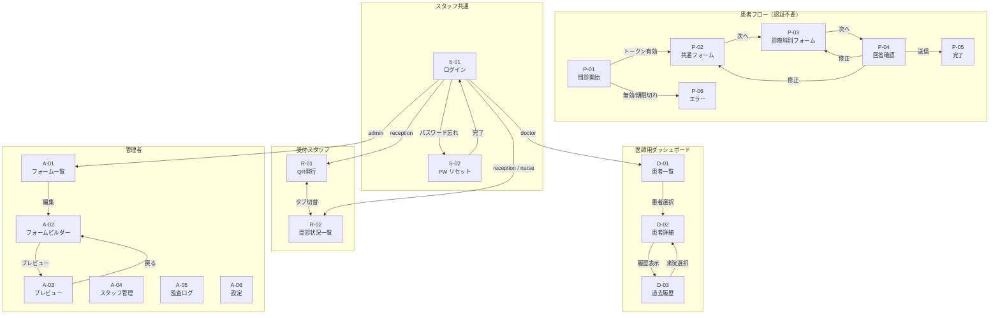

# 画面定義書
## デジタル問診システム (Medical Inquiry System)

| 項目 | 内容 |
|------|------|
| 文書バージョン | 1.0.0 |
| 作成日 | 2026-03-28 |
| 対象 | React SPA (TypeScript / Tailwind CSS) |

---

## 目次

1. [共通仕様](#1-共通仕様)
2. [画面一覧](#2-画面一覧)
3. [画面遷移図](#3-画面遷移図)
4. [患者向け画面](#4-患者向け画面)
   - [P-01 問診開始画面](#p-01-問診開始画面)
   - [P-02 問診フォーム（共通項目）](#p-02-問診フォーム共通項目)
   - [P-03 問診フォーム（診療科別）](#p-03-問診フォーム診療科別)
   - [P-04 回答確認画面](#p-04-回答確認画面)
   - [P-05 問診完了画面](#p-05-問診完了画面)
   - [P-06 エラー画面](#p-06-エラー画面)
5. [スタッフ共通画面](#5-スタッフ共通画面)
   - [S-01 ログイン画面](#s-01-ログイン画面)
   - [S-02 パスワードリセット画面](#s-02-パスワードリセット画面)
6. [受付スタッフ画面](#6-受付スタッフ画面)
   - [R-01 QRコード発行画面](#r-01-qrコード発行画面)
   - [R-02 本日の問診状況一覧](#r-02-本日の問診状況一覧)
7. [医師用ダッシュボード](#7-医師用ダッシュボード)
   - [D-01 患者一覧画面](#d-01-患者一覧画面)
   - [D-02 患者詳細・問診回答画面](#d-02-患者詳細問診回答画面)
   - [D-03 過去問診履歴画面](#d-03-過去問診履歴画面)
8. [管理者画面](#8-管理者画面)
   - [A-01 フォーム管理一覧](#a-01-フォーム管理一覧)
   - [A-02 フォームビルダー](#a-02-フォームビルダー)
   - [A-03 フォームプレビュー](#a-03-フォームプレビュー)
   - [A-04 スタッフ管理画面](#a-04-スタッフ管理画面)
   - [A-05 監査ログ閲覧画面](#a-05-監査ログ閲覧画面)
   - [A-06 システム設定画面](#a-06-システム設定画面)

---

## 1. 共通仕様

### 1.1 ブレークポイント（レスポンシブ）

| 区分 | 幅 | 主な用途 |
|------|----|---------|
| SP | 〜 767px | 患者スマートフォン、院内タブレット（縦） |
| TB | 768px 〜 1023px | 院内タブレット（横） |
| PC | 1024px 〜 | 医師・スタッフ・管理者画面 |

> 患者向け画面（P-01〜P-06）はSP優先設計。スタッフ・管理者画面はPC/TB対応。

### 1.2 共通ヘッダー（スタッフ向け）

```
┌──────────────────────────────────────────────────────────────────────┐
│ 🏥 問診システム            [内科] [外科]   山田 太郎 (医師) [ログアウト] │
└──────────────────────────────────────────────────────────────────────┘
```

| 要素 | 説明 |
|------|------|
| ロゴ | システム名クリックでロールのデフォルト画面へ |
| 診療科タブ | ログインユーザーの担当診療科のみ表示（admin は全科） |
| ユーザー情報 | 氏名・ロールを表示 |
| ログアウトボタン | クリックでJWT失効・S-01へリダイレクト |

### 1.3 共通サイドナビ（スタッフ向け）

| ロール | メニュー項目 |
|--------|------------|
| reception | QR発行 / 問診状況一覧 |
| nurse | 問診状況一覧 |
| doctor | 患者一覧 / 患者一覧（履歴） |
| admin | すべてのメニュー |

### 1.4 共通エラー・通知仕様

| 種別 | 表示場所 | 表示時間 | 用途 |
|------|---------|---------|------|
| トースト（成功） | 右上 | 3秒 | QR発行成功・保存完了等 |
| トースト（エラー） | 右上 | 5秒・手動閉じ | API失敗等 |
| インラインエラー | フォーム項目直下 | 入力修正まで | バリデーションエラー |
| モーダル確認 | 画面中央 | ユーザー操作まで | 削除・キャンセル等の破壊的操作 |

### 1.5 アクセシビリティ共通仕様

- フォントサイズ: 患者画面18px以上、スタッフ画面16px以上
- タッチターゲット: 44×44px以上
- フォーカスリング: 全インタラクティブ要素に可視フォーカスリング
- ARIAラベル: アイコンのみのボタンには `aria-label` 必須
- エラーメッセージ: `role="alert"` を付与してスクリーンリーダー対応

### 1.6 ローディング状態の共通表示

| 状態 | 表示 |
|------|------|
| ページ初期ロード | 全画面スケルトンUI |
| ボタン押下後の待機 | ボタン内スピナー + ボタン無効化 |
| AIサマリー生成中 | カード内スケルトン + 「AI分析中...」テキスト |

---

## 2. 画面一覧

| 画面ID | 画面名 | URL | アクセス権限 |
|--------|--------|-----|------------|
| P-01 | 問診開始画面 | `/inquiry?token={token}` | 認証不要（QRトークン） |
| P-02 | 問診フォーム（共通項目） | `/inquiry/form/common` | 〃 |
| P-03 | 問診フォーム（診療科別） | `/inquiry/form/department` | 〃 |
| P-04 | 回答確認画面 | `/inquiry/confirm` | 〃 |
| P-05 | 問診完了画面 | `/inquiry/complete` | 〃 |
| P-06 | エラー画面 | `/inquiry/error` | 〃 |
| S-01 | ログイン画面 | `/staff/login` | 未認証スタッフ |
| S-02 | パスワードリセット | `/staff/reset-password` | 未認証スタッフ |
| R-01 | QRコード発行画面 | `/reception/qr` | reception / admin |
| R-02 | 本日の問診状況一覧 | `/reception/sessions` | reception / nurse / admin |
| D-01 | 患者一覧画面（本日） | `/dashboard` | doctor / admin |
| D-02 | 患者詳細・問診回答画面 | `/dashboard/patient/{session_id}` | doctor / admin |
| D-03 | 過去問診履歴画面 | `/dashboard/patient/{patient_id}/history` | doctor / admin |
| A-01 | フォーム管理一覧 | `/admin/forms` | admin |
| A-02 | フォームビルダー | `/admin/forms/{id}/edit` | admin |
| A-03 | フォームプレビュー | `/admin/forms/{id}/preview` | admin |
| A-04 | スタッフ管理画面 | `/admin/staff` | admin |
| A-05 | 監査ログ閲覧画面 | `/admin/audit-logs` | admin |
| A-06 | システム設定画面 | `/admin/settings` | admin |

---

## 3. 画面遷移図



---

## 4. 患者向け画面

---

### P-01 問診開始画面

| 項目 | 内容 |
|------|------|
| 画面ID | P-01 |
| URL | `/inquiry?token={uuid}` |
| アクセス権限 | 認証不要（QRトークン検証） |
| 対象デバイス | SP / TB |
| 概要 | QRコードスキャン後の起点画面。トークンを検証し患者・予約情報を表示して問診を開始する |

#### レイアウト

```
┌─────────────────────────────────┐
│        🏥 ○○病院 問診票         │  ← ロゴ・病院名（システム設定から取得）
├─────────────────────────────────┤
│                                 │
│  ようこそ、田中 花子 様          │  ← 患者氏名（EHRから取得）
│                                 │
│  ┌─────────────────────────┐    │
│  │ 診療科   内 科           │    │
│  │ 予約日時 2026/03/28      │    │
│  │         午前 10:30       │    │
│  │ 担当医   山田 太郎 先生  │    │
│  └─────────────────────────┘    │
│                                 │
│  問診票へのご記入をお願いします。 │
│  所要時間は約 5〜10 分です。     │
│                                 │
│  ┌─── 個人情報の取り扱い ───┐   │
│  │ 入力いただいた情報は診察  │   │
│  │ のみに使用します。        │   │
│  └──────────────────────────┘   │
│                                 │
│  ┌─────────────────────────┐    │
│  │   問診票を記入する  →   │    │  ← プライマリボタン（大・全幅）
│  └─────────────────────────┘    │
│                                 │
│  ※ お急ぎの場合は受付までお越し  │
│    ください。                   │
└─────────────────────────────────┘
```

#### 表示項目

| 項目 | データソース | 説明 |
|------|------------|------|
| 患者氏名 | `GET /api/v1/sessions/{token}/info` の `patient_name` | 復号後の氏名 |
| 診療科 | 同API の `department_name` | |
| 予約日時 | 同API の `appointment_at` | JST表示 |
| 担当医 | 同API の `doctor_name`（任意） | NULLの場合は非表示 |

#### 操作・イベント

| 操作 | 処理 | 遷移先 |
|------|------|--------|
| 画面ロード | `GET /api/v1/sessions/{token}/info` を呼び出しトークン検証 | 無効時 → P-06 |
| 「問診票を記入する」ボタン押下 | LocalStorage にセッション情報を保存 | → P-02 |

#### エラーケース

| エラー | 表示 | 遷移 |
|--------|------|------|
| トークン無効 | — | → P-06（エラーコード: INVALID_TOKEN） |
| トークン期限切れ | — | → P-06（エラーコード: TOKEN_EXPIRED） |
| 問診完了済み | — | → P-06（エラーコード: ALREADY_COMPLETED） |
| API タイムアウト | トースト「通信に失敗しました」 | リトライボタン表示 |

#### API

```
GET /api/v1/sessions/{token}/info
Response: {
  "data": {
    "session_id": "uuid",
    "patient_name": "田中 花子",
    "department_name": "内科",
    "department_code": "naika",
    "appointment_at": "2026-03-28T10:30:00+09:00",
    "doctor_name": "山田 太郎",
    "form_definition_id": "uuid"
  }
}
```

---

### P-02 問診フォーム（共通項目）

| 項目 | 内容 |
|------|------|
| 画面ID | P-02 |
| URL | `/inquiry/form/common` |
| アクセス権限 | LocalStorage のセッション情報が必要 |
| 対象デバイス | SP / TB |
| 概要 | 全診療科共通の問診項目を6セクションのステップ形式で収集する |

#### レイアウト

```
┌─────────────────────────────────┐
│  ← 戻る     内科 問診票  2/6   │  ← ヘッダー（セクション番号）
├─────────────────────────────────┤
│  ██████████░░░░░░░░░░░░░░░░     │  ← プログレスバー（33%）
├─────────────────────────────────┤
│                                 │
│  【 主訴・症状 】               │  ← セクションタイトル
│                                 │
│  今日の受診理由を教えてください  │
│  ┌─────────────────────────┐    │
│  │ 3日前から続く発熱と咳が  │    │  ← textarea
│  │                          │    │
│  └─────────────────────────┘    │
│  残り 480/500文字                │
│                                 │
│  症状はいつ頃から始まりましたか  │
│  ◉ 今日     ○ 数日前           │  ← radio
│  ○ 1週間以上 ○ 1ヶ月以上       │
│                                 │
│  症状の程度（1〜10）            │
│  ○-○-○-○-◉-○-○-○-○-○         │  ← スケール
│  軽い  1  2  3  4  5  6  7  8  9  10  強い │
│                                 │
├─────────────────────────────────┤
│  ┌─────────────────────────┐    │
│  │       次へ  →           │    │  ← 次へボタン
│  └─────────────────────────┘    │
└─────────────────────────────────┘
```

#### セクション構成（6ステップ）

| Step | セクション名 | 主な質問項目 |
|------|------------|------------|
| 1 | 基本情報確認 | 氏名・生年月日・性別・電話番号の確認 |
| 2 | 主訴・症状 | 受診理由（自由記述）・開始時期・程度スケール |
| 3 | 既往歴・アレルギー | 既往歴チェックボックス・手術歴・薬剤/食物アレルギー |
| 4 | 現在服用中の薬 | 処方薬有無・薬品名・市販薬・サプリメント |
| 5 | 生活習慣 | 喫煙・飲酒・運動習慣 |
| 6 | 保険・同意 | 保険種別・個人情報同意・AI利用同意 |

#### 操作・イベント

| 操作 | 処理 |
|------|------|
| 各入力 | LocalStorage にリアルタイム保存 |
| 「次へ」ボタン | セクション単位でバリデーション → 次セクションへ or P-03へ |
| 「← 戻る」ボタン | 前セクション または P-01 へ |
| ブラウザバック | 前セクション（ブラウザ履歴に各セクションを push） |

#### バリデーション

| 項目 | ルール |
|------|--------|
| 受診理由 | 必須・1文字以上500文字以内 |
| 症状開始時期 | 必須 |
| 症状程度 | 必須（1〜10） |
| 既往歴 | 必須（「なし」含む） |
| アレルギー | 必須（「なし」含む）。「あり」選択時は詳細テキスト必須 |
| 服薬 | 「あり」選択時は薬品名必須 |
| 個人情報同意 | チェック必須（未チェックは次へ進めない） |
| AI利用同意 | チェック必須 |

#### API

```
なし（全回答はLocalStorageに保持し、P-04の送信時に一括POST）
```

---

### P-03 問診フォーム（診療科別）

| 項目 | 内容 |
|------|------|
| 画面ID | P-03 |
| URL | `/inquiry/form/department` |
| アクセス権限 | LocalStorage のセッション情報が必要 |
| 対象デバイス | SP / TB |
| 概要 | 診療科ごとの固有問診項目を動的分岐フォームで収集する |

#### レイアウト

```
┌─────────────────────────────────┐
│  ← 戻る     内科 問診票  5/6   │
├─────────────────────────────────┤
│  ████████████████████░░░░░░     │  ← プログレスバー（75%）
├─────────────────────────────────┤
│                                 │
│  【 内科 専用の質問 】          │
│                                 │
│  発熱はありますか？             │
│  ◉ はい  ○ いいえ              │
│                                 │
│  ┌── 発熱「はい」の場合 ──────┐  │  ← 動的に展開する追加質問
│  │ 最高体温（℃）              │  │
│  │ ┌──────────────┐           │  │
│  │ │ 38.5         │           │  │
│  │ └──────────────┘           │  │
│  │                             │  │
│  │ 解熱剤を服用しましたか？    │  │
│  │ ○ はい  ◉ いいえ           │  │
│  └─────────────────────────────┘  │
│                                 │
│  咳・痰はありますか？           │
│  ○ はい  ◉ いいえ              │
│                                 │
│  （以下、診療科の質問が続く）   │
│                                 │
├─────────────────────────────────┤
│  ┌─────────────────────────┐    │
│  │    確認画面へ  →        │    │
│  └─────────────────────────┘    │
└─────────────────────────────────┘
```

#### 動的分岐の動作仕様

| 動作 | 説明 |
|------|------|
| 追加質問の表示 | 対象の回答が条件に一致したとき、即時アニメーションで展開（fade-in） |
| 追加質問の非表示 | 回答変更で条件が外れたとき即時折り畳む。入力済みの値はリセット |
| 前に戻った場合 | 変更された回答に応じて分岐を再評価。以降の回答は保持しない |
| 身体図（整形外科） | SVGの人体図をタップして患部を複数選択 |
| 写真アップロード | お薬手帳等。JPEG/PNG・5MB以下。LocalStorageにBase64保存 |

#### バリデーション

| ルール | 詳細 |
|--------|------|
| 必須項目 | 各質問の `required: true` のもの |
| 数値範囲 | 体温：35.0〜42.0 ℃ など schema の `validation.min/max` に従う |
| 分岐表示中の必須 | 展開中の追加質問は必須チェックの対象に含める |

---

### P-04 回答確認画面

| 項目 | 内容 |
|------|------|
| 画面ID | P-04 |
| URL | `/inquiry/confirm` |
| 対象デバイス | SP / TB |
| 概要 | 送信前に全回答を一覧表示。修正リンクで該当セクションに戻れる |

#### レイアウト

```
┌─────────────────────────────────┐
│  ← 戻る        内科 問診票     │
├─────────────────────────────────┤
│  ████████████████████████████   │  ← 100%
├─────────────────────────────────┤
│                                 │
│  内容を確認してください         │
│                                 │
│  ▼ 主訴・症状           [修正] │  ← アコーディオン（展開済み）
│  ┌─────────────────────────┐    │
│  │ 受診理由: 3日前から続く発熱と咳│
│  │ 開始時期: 数日前             │
│  │ 程度: 6 / 10               │
│  └─────────────────────────┘    │
│                                 │
│  ▼ 既往歴・アレルギー    [修正] │
│  ┌─────────────────────────┐    │
│  │ 既往歴: 高血圧             │
│  │ 薬剤アレルギー: ペニシリン系│
│  └─────────────────────────┘    │
│                                 │
│  ▼ 服薬                 [修正] │
│  ...                            │
│                                 │
│  ▼ 内科専用            [修正]  │
│  ...                            │
│                                 │
│  ┌─────────────────────────┐    │
│  │ ✓ この内容で送信する    │    │  ← プライマリボタン（大）
│  └─────────────────────────┘    │
│                                 │
│  ※ 送信後の変更はできません     │
└─────────────────────────────────┘
```

#### 操作・イベント

| 操作 | 処理 | 遷移先 |
|------|------|--------|
| 「修正」リンク | 該当セクションのstepを指定してP-02またはP-03へ | P-02 / P-03 |
| 「この内容で送信する」 | ボタン無効化 → API呼び出し | → P-05（成功時） |
| 送信失敗 | トースト「送信に失敗しました。再度お試しください。」 | 画面維持 |

#### API

```
POST /api/v1/sessions/{session_id}/responses
Body: {
  "common_answers": { /* 共通項目 */ },
  "department_answers": { /* 科別項目 */ }
}
Response: {
  "data": { "response_id": "uuid" }
}
```

---

### P-05 問診完了画面

| 項目 | 内容 |
|------|------|
| 画面ID | P-05 |
| URL | `/inquiry/complete` |
| 対象デバイス | SP / TB |
| 概要 | 問診票の送信完了を患者に伝える終端画面 |

#### レイアウト

```
┌─────────────────────────────────┐
│            🏥 ○○病院            │
├─────────────────────────────────┤
│                                 │
│           ✅                    │
│                                 │
│    問診票の送信が              │
│    完了しました                │
│                                 │
│  ┌─────────────────────────┐    │
│  │ 診療科   内 科           │    │
│  │ 受付番号  A-042          │    │  ← inquiry_sessions.id の先頭5桁
│  └─────────────────────────┘    │
│                                 │
│  受付窓口にお越しいただき、      │
│  受付番号をお伝えください。     │
│                                 │
│  ─────────────────────────      │
│                                 │
│  ご記入いただきありがとうございました。│
│  この画面は閉じていただいて     │
│  構いません。                   │
│                                 │
└─────────────────────────────────┘
```

#### 仕様

- LocalStorage の問診データを完了後に削除する
- ブラウザバックで P-04 には戻れない（history.replaceState で制御）
- ページ離脱・ブラウザ閉じると以降はアクセス不可

---

### P-06 エラー画面

| 項目 | 内容 |
|------|------|
| 画面ID | P-06 |
| URL | `/inquiry/error?code={error_code}` |
| 対象デバイス | SP / TB |
| 概要 | QRトークン不正・期限切れ等のエラーを患者にわかりやすく表示 |

#### レイアウト

```
┌─────────────────────────────────┐
│            🏥 ○○病院            │
├─────────────────────────────────┤
│                                 │
│           ⚠️                    │
│                                 │
│    このQRコードは               │
│    ご利用いただけません         │
│                                 │
│  ┌─────────────────────────┐    │
│  │ 考えられる原因:          │    │
│  │ ・有効期限が切れています  │    │
│  │ ・すでに使用済みです      │    │
│  │ ・URLが正しくありません   │    │
│  └─────────────────────────┘    │
│                                 │
│  お手数ですが受付窓口へ         │
│  お越しください。              │
│                                 │
│  ── お問い合わせ ──            │
│  受付電話: 03-XXXX-XXXX         │
│                                 │
└─────────────────────────────────┘
```

#### エラーコード別メッセージ

| error_code | タイトル | 説明文 |
|-----------|---------|--------|
| INVALID_TOKEN | ご利用いただけません | URLが正しくないか、トークンが無効です |
| TOKEN_EXPIRED | 有効期限切れです | 予約日を過ぎたためご利用できません |
| ALREADY_COMPLETED | 送信済みです | すでに問診票を送信済みです |
| SESSION_CANCELLED | キャンセルされました | 受付によりキャンセルされました |
| SERVER_ERROR | システムエラー | 時間をおいて再度お試しください |

---

## 5. スタッフ共通画面

---

### S-01 ログイン画面

| 項目 | 内容 |
|------|------|
| 画面ID | S-01 |
| URL | `/staff/login` |
| アクセス権限 | 未認証（認証済みは自動リダイレクト） |
| 対象デバイス | SP / TB / PC |
| 概要 | スタッフ共通のログイン画面 |

#### レイアウト

```
┌────────────────────────────────────────────┐
│                                            │
│         🏥 問診システム                    │
│         スタッフ専用ログイン               │
│                                            │
│  メールアドレス                            │
│  ┌──────────────────────────────────────┐  │
│  │ yamada@hospital.example.com          │  │
│  └──────────────────────────────────────┘  │
│                                            │
│  パスワード                                │
│  ┌──────────────────────────────────────┐  │
│  │ ••••••••••                      👁️  │  │
│  └──────────────────────────────────────┘  │
│                                            │
│  ⚠️ メールアドレスまたはパスワードが       │  ← エラー時のみ表示
│     正しくありません                       │
│                                            │
│  ┌──────────────────────────────────────┐  │
│  │          ログイン                    │  │
│  └──────────────────────────────────────┘  │
│                                            │
│  パスワードをお忘れの方は → こちら        │  → S-02
│                                            │
└────────────────────────────────────────────┘
```

#### バリデーション

| 項目 | ルール |
|------|--------|
| メールアドレス | 必須・メール形式 |
| パスワード | 必須・8文字以上 |

#### 操作・イベント

| 操作 | 処理 | 遷移先 |
|------|------|--------|
| ログインボタン | `POST /api/v1/auth/login` → JWTをCookieにセット | ロール別デフォルト画面へ |
| 失敗5回目 | 「30分後に再試行してください」表示・ボタン無効化 | — |

#### ロール別リダイレクト先

| ロール | リダイレクト先 |
|--------|-------------|
| admin | A-01 |
| doctor | D-01 |
| nurse | R-02 |
| reception | R-01 |

#### API

```
POST /api/v1/auth/login
Body: { "email": "...", "password": "..." }
Response: { "data": { "access_token": "...", "token_type": "Bearer", "expires_in": 900, "user": { "role": "doctor" } } }
```

---

### S-02 パスワードリセット画面

| 項目 | 内容 |
|------|------|
| 画面ID | S-02 |
| URL | `/staff/reset-password` |
| 概要 | メール送信によるパスワードリセット申請 |

#### レイアウト（2ステップ）

```
【Step 1: メール送信申請】
┌────────────────────────────────────────────┐
│  パスワードをリセット                       │
│                                            │
│  登録済みのメールアドレスを入力してください │
│  ┌──────────────────────────────────────┐  │
│  │ yamada@hospital.example.com          │  │
│  └──────────────────────────────────────┘  │
│                                            │
│  ┌──────────────────────────────────────┐  │
│  │      リセットメールを送信            │  │
│  └──────────────────────────────────────┘  │
│                                            │
│  ← ログインに戻る                         │
└────────────────────────────────────────────┘

【Step 2: 送信完了】
┌────────────────────────────────────────────┐
│  ✅ メールを送信しました                   │
│                                            │
│  メールに記載されたリンクから              │
│  パスワードを再設定してください。          │
│  ※ リンクの有効期限は30分です             │
└────────────────────────────────────────────┘
```

---

## 6. 受付スタッフ画面

---

### R-01 QRコード発行画面

| 項目 | 内容 |
|------|------|
| 画面ID | R-01 |
| URL | `/reception/qr` |
| アクセス権限 | reception / admin |
| 対象デバイス | PC / TB |
| 概要 | 来院患者に対してQRコードを発行する。事前予約がない患者や当日来院時に使用 |

#### レイアウト

```
┌──────────────────────────────────────────────────────────────────────┐
│  🏥 問診システム        [問診状況一覧] [QR発行]   受付 鈴木 [ログアウト]│
├──────────────────────┬───────────────────────────────────────────────┤
│                      │                                               │
│  QRコード発行        │           発行済みQRコード                    │
│                      │                                               │
│  患者ID              │  ┌──────────────────────────────────────┐    │
│  ┌────────────────┐  │  │                                      │    │
│  │ 000123         │  │  │                                      │    │
│  └────────────────┘  │  │     ██████████████████████           │    │
│                      │  │     ██    ██    ██    ██             │    │
│  診療科              │  │     ██  ████  ████  ████             │    │
│  ┌────────────────┐  │  │     ██████████████████████           │    │
│  │ 内科       ∨  │  │  │                                      │    │
│  └────────────────┘  │  │           QRコード                   │    │
│                      │  │                                      │    │
│  予約日時            │  │  患者ID: 000123                       │    │
│  ┌────────────────┐  │  │  診療科: 内科                        │    │
│  │ 2026/03/28     │  │  │  有効期限: 2026/03/29 00:00          │    │
│  │ 10:30          │  │  │                                      │    │
│  └────────────────┘  │  │  ┌──────────┐  ┌──────────────┐    │    │
│                      │  │  │  印 刷   │  │ 画像保存（PNG）│   │    │
│  担当医（任意）      │  │  └──────────┘  └──────────────┘    │    │
│  ┌────────────────┐  │  └──────────────────────────────────────┘    │
│  │ 山田 太郎  ∨  │  │                                               │
│  └────────────────┘  │                                               │
│                      │                                               │
│  ┌────────────────┐  │                                               │
│  │   QR発行する   │  │                                               │
│  └────────────────┘  │                                               │
│                      │                                               │
└──────────────────────┴───────────────────────────────────────────────┘
```

#### 操作・イベント

| 操作 | 処理 |
|------|------|
| 「QR発行する」ボタン | バリデーション → `POST /api/v1/sessions` → QR画像生成・右パネルに表示 |
| 「印刷」ボタン | ブラウザ印刷ダイアログ（QRコードと患者情報のみ印刷） |
| 「画像保存（PNG）」ボタン | QRコードのPNG画像をダウンロード |

#### バリデーション

| 項目 | ルール |
|------|--------|
| 患者ID | 必須・数字のみ |
| 診療科 | 必須・選択式 |
| 予約日時 | 必須・過去日時は不可 |
| 担当医 | 任意・doctorロールのスタッフのみ選択可 |

#### API

```
POST /api/v1/sessions
Body: {
  "external_patient_id": "000123",
  "department_id": "uuid",
  "appointment_at": "2026-03-28T01:30:00Z",
  "doctor_id": "uuid-doctor"
}
Response: {
  "data": {
    "session_id": "uuid",
    "qr_token": "uuid-v4",
    "qr_image_url": "/api/v1/sessions/{id}/qr.png",
    "qr_expires_at": "2026-03-29T15:00:00Z",
    "doctor_name": "山田 太郎"
  }
}
```

---

### R-02 本日の問診状況一覧

| 項目 | 内容 |
|------|------|
| 画面ID | R-02 |
| URL | `/reception/sessions` |
| アクセス権限 | reception / nurse / admin |
| 対象デバイス | PC / TB |
| 概要 | 本日の問診セッション一覧をリアルタイムで表示・管理する |

#### レイアウト

```
┌──────────────────────────────────────────────────────────────────────┐
│  🏥 問診システム        [問診状況一覧] [QR発行]   受付 鈴木 [ログアウト]│
├──────────────────────────────────────────────────────────────────────┤
│  本日の問診状況（2026/03/28）                      [更新] 最終更新 09:45│
│                                                                      │
│  診療科: [すべて ∨]   ステータス: [すべて ∨]   🔍 患者IDで検索      │
├──────────────────────────────────────────────────────────────────────┤
│  集計: 完了 12件 / 記入中 5件 / 未開始 23件 / キャンセル 2件         │
├──────────────────────────────────────────────────────────────────────┤
│  患者ID  │ 診療科 │ 予約時刻 │ ステータス       │ 経過時間 │ 操作    │
├──────────────────────────────────────────────────────────────────────┤
│  000123  │ 内科   │ 10:30   │ 🟡 記入中        │ 23分     │ [取消]  │
│  000456  │ 内科   │ 10:45   │ 🟢 完了          │ —        │ [詳細]  │
│  000789  │ 外科   │ 11:00   │ ⚪ 未開始        │ —        │ [QR再発行]│
│  000111  │ 内科   │ 10:15   │ 🔴 未開始 ⚠️45分 │ 45分     │ [QR再発行]│
│  ...                                                                │
└──────────────────────────────────────────────────────────────────────┘
```

#### ステータスバッジ

| ステータス | バッジ色 | 表示テキスト |
|---------|---------|------------|
| pending | グレー ⚪ | 未開始 |
| pending + 30分超過 | オレンジ ⚠️ | 未開始（経過時間） |
| in_progress | 黄色 🟡 | 記入中 |
| completed | 緑 🟢 | 完了 |
| cancelled | グレー | キャンセル |
| expired | 赤 🔴 | 期限切れ |

#### 操作・イベント

| 操作 | 処理 | 確認ダイアログ |
|------|------|------------|
| 「取消」ボタン | `PATCH /api/v1/sessions/{id}` status→cancelled | あり（「取り消しますか？」） |
| 「QR再発行」ボタン | `POST /api/v1/sessions/{id}/reissue-qr` → R-01に遷移してQR表示 | なし |
| 「詳細」ボタン（nurse不可） | D-02に遷移 | なし |
| 「更新」ボタン | データ再取得 | なし |

> 自動更新: 30秒ごとにポーリング（WebSocket未使用）

---

## 7. 医師用ダッシュボード

---

### D-01 患者一覧画面

| 項目 | 内容 |
|------|------|
| 画面ID | D-01 |
| URL | `/dashboard` |
| アクセス権限 | doctor / admin |
| 対象デバイス | PC / TB |
| 概要 | 本日の担当患者一覧。問診完了・AIサマリー状態を一覧で把握し優先度の高い患者を識別する |

#### レイアウト

```
┌──────────────────────────────────────────────────────────────────────┐
│  🏥 問診システム  [内科] [外科]    山田 太郎 (医師)   [ログアウト]    │
├──────────────────────────────────────────────────────────────────────┤
│  本日の患者一覧（内科） 2026/03/28                                    │
│                                                                      │
│  ステータス: [すべて ∨]   🔍 患者ID / 名前で検索     [日付変更: ∨]  │
├─────────────────────────────────────────────────────────────────────┤
│  ⚠️ 要注意あり: 3件    ✅ AI分析完了: 8件    ⏳ AI分析中: 2件      │
├──────────────┬────────┬──────────┬────────────────┬──────────────────┤
│ 患者ID / 氏名│ 予約   │ 問診     │ AIサマリー     │ 要注意フラグ     │
├──────────────┼────────┼──────────┼────────────────┼──────────────────┤
│ ⚠️ 000456   │ 10:00  │ 🟢 完了  │ ✅ 分析完了    │ アレルギー・服薬 │  ← 強調行（赤背景）
│    田中 花子 │        │          │                │                  │
├──────────────┼────────┼──────────┼────────────────┼──────────────────┤
│ ⚠️ 000789   │ 10:15  │ 🟢 完了  │ ✅ 分析完了    │ 緊急フラグ       │  ← 強調行（赤背景）
│    鈴木 一郎 │        │          │                │                  │
├──────────────┼────────┼──────────┼────────────────┼──────────────────┤
│    001234   │ 10:30  │ 🟢 完了  │ ⏳ 分析中...   │ —               │
│    佐藤 美咲 │        │          │                │                  │
├──────────────┼────────┼──────────┼────────────────┼──────────────────┤
│    001567   │ 11:00  │ 🟡 記入中│ —              │ —               │
│    高橋 健二 │        │          │                │                  │
└──────────────┴────────┴──────────┴────────────────┴──────────────────┘
（クリックで D-02 へ）
```

#### 要注意フラグの表示ルール

| フラグ種別 | 表示色 | 表示文言 |
|-----------|--------|---------|
| 緊急フラグ（胸痛+放散痛等） | 赤背景 | 🚨 緊急フラグ |
| 薬剤アレルギー | 赤背景 | ⚠️ アレルギー |
| 服薬リスク（抗凝固薬等） | 赤背景 | ⚠️ 服薬リスク |
| フラグなし | 通常 | — |

#### 操作・イベント

| 操作 | 処理 | 遷移先 |
|------|------|--------|
| 行クリック | — | D-02 |
| 診療科タブ切替 | フィルタ変更・リスト再取得 | — |
| 日付変更 | 指定日のデータ取得 | — |

#### API

```
GET /api/v1/dashboard/sessions?date=2026-03-28&department_id={uuid}
Response: { "data": [{ session_id, patient_name, appointment_at,
                       session_status, ai_status, risk_flags[] }] }
```

---

### D-02 患者詳細・問診回答画面

| 項目 | 内容 |
|------|------|
| 画面ID | D-02 |
| URL | `/dashboard/patient/{session_id}` |
| アクセス権限 | doctor / admin |
| 対象デバイス | PC（2カラム必須）/ TB（タブ切替） |
| 概要 | 問診回答全文とAIサマリーを2カラムで並べて表示。診察前の情報把握に使用する |

#### レイアウト（PC: 2カラム）

```
┌──────────────────────────────────────────────────────────────────────┐
│  🏥 問診システム  [内科] [外科]    山田 太郎 (医師)   [ログアウト]    │
├──────────────────────────────────────────────────────────────────────┤
│  ← 患者一覧へ    田中 花子（ID: 000456）内科  2026/03/28 10:00       │
│                                      [PDF出力] [MegaOakHRで開く↗]   │
├───────────────────────────┬──────────────────────────────────────────┤
│  問診回答                  │  🤖 AI サマリー  ※参考情報              │
│                            │  （医師の判断を代替するものではありません）│
│  ── 基本情報 ──           │  ─────────────────────────────────────   │
│  性別: 女性                │  【症状要約】                            │
│  生年月日: 1975/08/15     │  患者は3日前から発熱（38.5℃）と湿性の   │
│  電話: 090-XXXX-XXXX      │  咳を訴えている。症状の程度は10段階中6。 │
│                            │                                          │
│  ── 主訴・症状 ──         │  ─────────────────────────────────────   │
│  受診理由: 3日前から続く   │  【要注意フラグ】                        │
│    発熱と咳                │  🚨 薬剤アレルギー                       │
│  開始時期: 数日前          │     ペニシリン系（アナフィラキシー歴あり）│
│  程度: 6 / 10              │  ⚠️  服薬リスク                         │
│                            │     ワーファリン服用中                   │
│  ── 既往歴 ──             │                                          │
│  高血圧（加療中）          │  ─────────────────────────────────────   │
│  アレルギー:               │  【推奨確認事項】                        │
│    ペニシリン系（★要注意）│  1. 抗生剤選択時のアレルギー歴確認      │
│                            │  2. ワーファリン用量・PT-INR値の確認    │
│  ── 服薬 ──              │  3. 喀痰培養検査の検討                   │
│  ワーファリン 2mg/日       │                                          │
│                            │  ─────────────────────────────────────   │
│  ── 生活習慣 ──           │  【前回との差分】                        │
│  喫煙: なし                │  前回来院: 2025-12-15（内科）            │
│  飲酒: 機会飲酒            │  ・新規症状: 発熱、咳（前回なし）       │
│  運動: 週2〜3回            │  ・継続: 高血圧既往（変化なし）         │
│                            │                                          │
│  ── 内科専用 ──           │  ─────────────────────────────────────   │
│  発熱: あり（38.5℃）      │  分析日時: 2026-03-28 09:42             │
│  解熱剤: 使用済み          │  モデル: claude-sonnet-4-6              │
│  咳: あり（湿性）          │                                          │
│  血痰: なし                │  [過去の問診を見る]                     │
│  ...                       │                                          │
└───────────────────────────┴──────────────────────────────────────────┘
```

#### レイアウト（TB: タブ切替）

```
┌────────────────────────────────┐
│  [問診回答] [AIサマリー]       │  ← タブ
├────────────────────────────────┤
│  （選択中タブのコンテンツ）    │
└────────────────────────────────┘
```

#### 操作・イベント

| 操作 | 処理 | 遷移先 |
|------|------|--------|
| 「← 患者一覧へ」 | — | D-01 |
| 「PDF出力」ボタン | `GET /api/v1/responses/{id}/pdf` → ファイルダウンロード | — |
| 「MegaOakHRで開く」 | NEC MegaOakHRのFHIRリソースURLを新タブで開く | 別タブ |
| 「過去の問診を見る」 | — | D-03 |
| AIサマリーが「分析中」 | 10秒ごとにポーリング。完了したら自動更新 | — |

#### API

```
GET /api/v1/dashboard/sessions/{session_id}
Response: {
  "data": {
    "session": { session_id, appointment_at, department_name },
    "patient": { patient_id, name, gender, dob, phone },
    "response": { common_answers, department_answers },
    "ai_summary": {
      "status": "completed",
      "symptom_summary": "...",
      "risk_flags": [...],
      "recommendations": [...],
      "diff_from_previous": "...",
      "processed_at": "..."
    },
    "fhir_resource_id": "..."
  }
}
```

---

### D-03 過去問診履歴画面

| 項目 | 内容 |
|------|------|
| 画面ID | D-03 |
| URL | `/dashboard/patient/{patient_id}/history` |
| アクセス権限 | doctor / admin |
| 対象デバイス | PC / TB |
| 概要 | 患者の過去の問診を時系列で表示。任意の来院をクリックして D-02 で詳細確認できる |

#### レイアウト

```
┌──────────────────────────────────────────────────────────────────────┐
│  🏥 問診システム  [内科] [外科]    山田 太郎 (医師)   [ログアウト]    │
├──────────────────────────────────────────────────────────────────────┤
│  ← 戻る   田中 花子（ID: 000456）過去の問診履歴                      │
├──────────────────────────────────────────────────────────────────────┤
│                                                                      │
│  2026年  ━━━━━━━━━━━━━━━━━━━━━━━━━━━━━━━━━━━━━━━━━━━━━━━━━━         │
│                                                                      │
│  2026-03-28  ●━━  内科                         [この回答を見る →]  │
│              │     発熱・咳 ／ ⚠️ アレルギー                       │
│              │     AIサマリー: 発熱38.5℃、ペニシリン注意             │
│              │                                                      │
│  2025-12-15  ●━━  内科                         [この回答を見る →]  │
│              │     頭痛・倦怠感                                     │
│              │     AIサマリー: 緊急フラグなし                       │
│              │                                                      │
│  2025年  ━━━━━━━━━━━━━━━━━━━━━━━━━━━━━━━━━━━━━━━━━━━━━━━━━━━━━━━━━━  │
│                                                                      │
│  2025-08-10  ●━━  外科                         [この回答を見る →]  │
│                    腰痛                                              │
│                                                                      │
│  （以下続く）                                                        │
└──────────────────────────────────────────────────────────────────────┘
```

#### API

```
GET /api/v1/patients/{patient_id}/sessions
Response: { "data": [{ session_id, appointment_at, department_name,
                       chief_complaint, risk_flags[], ai_summary_excerpt }] }
```

---

## 8. 管理者画面

---

### A-01 フォーム管理一覧

| 項目 | 内容 |
|------|------|
| 画面ID | A-01 |
| URL | `/admin/forms` |
| アクセス権限 | admin |
| 対象デバイス | PC |
| 概要 | 診療科ごとのフォーム定義バージョンを一覧表示し、公開・編集・新規作成を行う |

#### レイアウト

```
┌──────────────────────────────────────────────────────────────────────┐
│  🏥 管理者画面  [フォーム] [スタッフ] [監査ログ] [設定]  [ログアウト] │
├──────────────────────────────────────────────────────────────────────┤
│  フォーム管理                                      [新規フォーム作成] │
├──────────────────────────────────────────────────────────────────────┤
│                                                                      │
│  ■ 内科                                                              │
│  ┌──────────┬──────┬──────────────┬────────────────┬──────────────┐ │
│  │ バージョン│状態  │ 更新日時      │ 作成者         │ 操作         │ │
│  ├──────────┼──────┼──────────────┼────────────────┼──────────────┤ │
│  │ v3       │🟢公開│ 2026-02-10   │ 管理者 田中    │ [編集][複製] │ │
│  │ v2       │📦保存│ 2025-10-01   │ 管理者 田中    │ [参照]       │ │
│  │ v1       │📦保存│ 2025-06-01   │ 管理者 田中    │ [参照]       │ │
│  └──────────┴──────┴──────────────┴────────────────┴──────────────┘ │
│                                                                      │
│  ■ 外科・整形外科                                                    │
│  ┌──────────┬──────┬──────────────┬────────────────┬──────────────┐ │
│  │ v2       │🟢公開│ 2026-01-15   │ 管理者 田中    │ [編集][複製] │ │
│  │ v1       │📦保存│ 2025-08-01   │ 管理者 田中    │ [参照]       │ │
│  └──────────┴──────┴──────────────┴────────────────┴──────────────┘ │
│                                                                      │
│  ■ 産婦人科  / ■ 小児科  （同様）                                   │
└──────────────────────────────────────────────────────────────────────┘
```

#### 操作・イベント

| 操作 | 処理 | 遷移先 |
|------|------|--------|
| 「新規フォーム作成」 | 診療科選択モーダル → 新規 form_definition 作成 | A-02 |
| 「編集」 | — | A-02 |
| 「複製」 | 公開中フォームをドラフトとして複製 | A-02 |
| 「参照」 | 過去バージョンを読み取り専用表示 | A-02（読み取り専用） |

---

### A-02 フォームビルダー

| 項目 | 内容 |
|------|------|
| 画面ID | A-02 |
| URL | `/admin/forms/{id}/edit` |
| アクセス権限 | admin |
| 対象デバイス | PC |
| 概要 | GUIで質問・分岐ロジックを設定するフォーム定義エディタ |

#### レイアウト

```
┌──────────────────────────────────────────────────────────────────────┐
│  ← フォーム一覧    内科 問診票 v4（ドラフト）  [保存] [プレビュー] [公開する]│
├───────────────────┬──────────────────────────────┬───────────────────┤
│ 質問タイプ         │     フォーム構成（中央）      │ 選択中の設定      │
│ ┌───────────────┐ │                               │                   │
│ │ ≡ テキスト    │ │ セクション: 発熱・呼吸器      │ 質問ラベル        │
│ │ # 数値        │ │ ┌───────────────────────────┐ │ ┌───────────────┐ │
│ │ 📅 日付       │ │ │ Q: 発熱はありますか？      │ │ │ 発熱はありますか│ │
│ │ ● ラジオ      │ │ │ 種類: ラジオ [必須]        │ │ └───────────────┘ │
│ │ ☑ チェックボックス│ │ │ 選択肢: はい / いいえ   │ │                   │
│ │ 📊 スケール   │ │ │ ┌── 分岐 ─────────────┐  │ │ 必須  [ON]        │
│ │ 🫁 身体図    │ │ │ │ はい → 体温を表示     │  │ │                   │
│ │ 📷 写真       │ │ │ └──────────────────────┘  │ │ 選択肢            │
│ └───────────────┘ │ └───────────────────────────┘ │ ┌───────────────┐ │
│                   │                               │ │ はい    [×]   │ │
│ ← ドラッグして    │ [+ 質問を追加]               │ │ いいえ  [×]   │ │
│   フォームに      │                               │ │ [+ 選択肢追加] │ │
│   追加            │                               │ └───────────────┘ │
│                   │                               │                   │
│                   │                               │ 分岐設定          │
│                   │                               │ 「はい」を選んだら │
│                   │                               │ → [体温入力] を表示│
└───────────────────┴──────────────────────────────┴───────────────────┘
```

#### 操作・イベント

| 操作 | 処理 |
|------|------|
| 質問タイプをドラッグ | フォームの任意位置に質問を追加 |
| 質問クリック | 右パネルに設定が表示される |
| 「保存」ボタン | `PUT /api/v1/forms/{id}` でドラフト保存 |
| 「プレビュー」ボタン | A-03 を新タブで開く |
| 「公開する」ボタン | 確認モーダル → `POST /api/v1/forms/{id}/publish` → 現在の公開版をアーカイブ |

#### 公開時の確認モーダル

```
┌──────────────────────────────────────┐
│  ⚠️ フォームを公開しますか？         │
│                                      │
│  内科 v4 を公開すると、             │
│  現在の v3 はアーカイブされます。   │
│  以降の患者問診はこの内容で行われます│
│                                      │
│  [キャンセル]          [公開する]    │
└──────────────────────────────────────┘
```

---

### A-03 フォームプレビュー

| 項目 | 内容 |
|------|------|
| 画面ID | A-03 |
| URL | `/admin/forms/{id}/preview` |
| アクセス権限 | admin |
| 対象デバイス | PC（SP/TBエミュレーション付き） |
| 概要 | 患者目線でフォームを確認するプレビュー画面。回答データは保存しない |

#### レイアウト

```
┌──────────────────────────────────────────────────────────────────────┐
│  プレビュー: 内科 v4（ドラフト）    [SP表示] [TB表示]   [← 編集に戻る]│
├──────────────────────────────────────────────────────────────────────┤
│                                                                      │
│          ┌─────────────────────────────────┐                         │
│          │     ← ここが患者の画面 →        │                         │
│          │                                 │                         │
│          │  （P-02/P-03 と同じUI）         │                         │
│          │                                 │                         │
│          │  ※ このプレビューは管理者専用   │                         │
│          │    です。送信はできません。     │                         │
│          └─────────────────────────────────┘                         │
│                                                                      │
└──────────────────────────────────────────────────────────────────────┘
```

---

### A-04 スタッフ管理画面

| 項目 | 内容 |
|------|------|
| 画面ID | A-04 |
| URL | `/admin/staff` |
| アクセス権限 | admin |
| 対象デバイス | PC |
| 概要 | スタッフアカウントの作成・ロール設定・有効/無効の管理 |

#### レイアウト

```
┌──────────────────────────────────────────────────────────────────────┐
│  🏥 管理者画面  [フォーム] [スタッフ] [監査ログ] [設定]  [ログアウト] │
├──────────────────────────────────────────────────────────────────────┤
│  スタッフ管理                                      [+ スタッフ追加]  │
│                                                                      │
│  ロール: [すべて ∨]   状態: [有効 ∨]    🔍 名前・メールで検索       │
├──────────────────────────────────────────────────────────────────────┤
│  氏名          │ メールアドレス          │ ロール   │ 担当科  │ 状態  │ 操作  │
├──────────────────────────────────────────────────────────────────────┤
│ 山田 太郎      │ yamada@hosp.example    │ 医師     │ 内科   │ 🟢有効│ [編集]│
│ 鈴木 花子      │ suzuki@hosp.example    │ 受付     │ 全科   │ 🟢有効│ [編集]│
│ 田中 管理      │ tanaka@hosp.example    │ 管理者   │ 全科   │ 🟢有効│ [編集]│
│ 佐藤 次郎      │ sato@hosp.example      │ 看護師   │ 内科   │ 🔴無効│ [編集]│
└──────────────────────────────────────────────────────────────────────┘
```

#### スタッフ追加・編集モーダル

```
┌────────────────────────────────────┐
│  スタッフ情報                       │
│                                    │
│  氏名                              │
│  ┌──────────────────────────────┐  │
│  │ 山田 太郎                    │  │
│  └──────────────────────────────┘  │
│                                    │
│  メールアドレス                    │
│  ┌──────────────────────────────┐  │
│  │ yamada@hospital.example.com  │  │
│  └──────────────────────────────┘  │
│                                    │
│  ロール    [医師 ∨]                │
│                                    │
│  担当診療科（複数選択可）          │
│  ☑ 内科  ☐ 外科  ☐ 産婦人科      │
│  ☐ 小児科                         │
│                                    │
│  ┌─────────────────────────────┐  │
│  │ 初期パスワードを送信（メール）│  │
│  └─────────────────────────────┘  │
│                                    │
│  [キャンセル]           [保存]     │
└────────────────────────────────────┘
```

---

### A-05 監査ログ閲覧画面

| 項目 | 内容 |
|------|------|
| 画面ID | A-05 |
| URL | `/admin/audit-logs` |
| アクセス権限 | admin |
| 対象デバイス | PC |
| 概要 | スタッフの操作ログを検索・閲覧する。CSVエクスポート可能 |

#### レイアウト

```
┌──────────────────────────────────────────────────────────────────────┐
│  🏥 管理者画面  [フォーム] [スタッフ] [監査ログ] [設定]  [ログアウト] │
├──────────────────────────────────────────────────────────────────────┤
│  監査ログ                                              [CSVエクスポート]│
│                                                                      │
│  期間: [2026/03/28] 〜 [2026/03/28]                                  │
│  操作者: [すべて ∨]   操作種別: [すべて ∨]   リソース: [すべて ∨]   │
│                                                   [検索]             │
├──────────────────────────────────────────────────────────────────────┤
│  日時                │ 操作者      │ 操作種別    │ 対象           │ IP  │
├──────────────────────────────────────────────────────────────────────┤
│ 2026-03-28 09:42:31 │ 山田 太郎   │ read        │ inquiry_response│ ... │
│ 2026-03-28 09:40:00 │ 山田 太郎   │ export(PDF) │ inquiry_response│ ... │
│ 2026-03-28 09:35:11 │ 鈴木 花子   │ qr_issued   │ inquiry_session │ ... │
│ 2026-03-28 09:30:05 │ 山田 太郎   │ login       │ staff_users     │ ... │
│  ...                                                                │
├──────────────────────────────────────────────────────────────────────┤
│  1〜20件 / 342件                    [< 前] [1] [2] ... [18] [次 >]  │
└──────────────────────────────────────────────────────────────────────┘
```

#### フィルタ仕様

| フィルタ | 値 |
|---------|-----|
| 期間 | 日付範囲（最大90日間） |
| 操作者 | スタッフ一覧から選択 |
| 操作種別 | read / create / update / delete / export / login / logout / login_failed / qr_issued / form_published |
| リソース | inquiry_response / patient / form_definition / staff_users |

#### API

```
GET /api/v1/admin/audit-logs?from=2026-03-28&to=2026-03-28&action=read&page=1
GET /api/v1/admin/audit-logs/export?from=...&to=...  （CSV）
```

---

### A-06 システム設定画面

| 項目 | 内容 |
|------|------|
| 画面ID | A-06 |
| URL | `/admin/settings` |
| アクセス権限 | admin |
| 対象デバイス | PC |
| 概要 | 病院名・QR有効期限・問診未完了アラート時間などシステム全体の設定を管理する |

#### レイアウト

```
┌──────────────────────────────────────────────────────────────────────┐
│  🏥 管理者画面  [フォーム] [スタッフ] [監査ログ] [設定]  [ログアウト] │
├──────────────────────────────────────────────────────────────────────┤
│  システム設定                                              [保存する] │
│                                                                      │
│  ─── 病院基本情報 ───────────────────────────────────────────────   │
│                                                                      │
│  病院名                                                              │
│  ┌──────────────────────────────────────────────────────────────┐   │
│  │ ○○総合病院                                                   │   │
│  └──────────────────────────────────────────────────────────────┘   │
│                                                                      │
│  受付電話番号（エラー画面に表示）                                    │
│  ┌──────────────────────────────────────────────────────────────┐   │
│  │ 03-XXXX-XXXX                                                 │   │
│  └──────────────────────────────────────────────────────────────┘   │
│                                                                      │
│  ─── QR・問診設定 ───────────────────────────────────────────────   │
│                                                                      │
│  問診未完了アラート表示時間（分）                                    │
│  ┌──────────────┐                                                    │
│  │ 30           │  分                                               │
│  └──────────────┘                                                    │
│                                                                      │
│  ─── AIサマリー設定 ─────────────────────────────────────────────   │
│                                                                      │
│  AIサマリー機能                            [有効 ●────○ 無効]       │
│                                                                      │
│  免責文（AIサマリー画面に表示）                                      │
│  ┌──────────────────────────────────────────────────────────────┐   │
│  │ ※ このサマリーはAIが生成した参考情報です。医師の診断・       │   │
│  │   治療の指針を代替するものではありません。                   │   │
│  └──────────────────────────────────────────────────────────────┘   │
│                                                                      │
└──────────────────────────────────────────────────────────────────────┘
```

---

## 付録：コンポーネント対応表

| UIコンポーネント | 使用画面 | 備考 |
|---------------|---------|------|
| `<QuestionRenderer>` | P-02, P-03, A-03 | 質問タイプ別にサブコンポーネントへ委譲 |
| `<BranchEngine>` | P-03 | 分岐ロジック評価・表示制御 |
| `<ProgressBar>` | P-02, P-03, P-04 | セクション進捗 |
| `<QRDisplay>` | R-01 | QRコード画像表示・印刷 |
| `<SessionTable>` | R-02 | ステータスバッジ・ポーリング |
| `<PatientTable>` | D-01 | 要注意フラグ強調表示 |
| `<AiSummaryPanel>` | D-02 | スケルトン・ポーリング |
| `<FormBuilder>` | A-02 | D&D・分岐設定 |
| `<AuditLogTable>` | A-05 | ページネーション・フィルタ |
| `<StatusBadge>` | R-02, D-01 | session_status に応じた色・ラベル |
| `<Toast>` | 全スタッフ画面 | 成功/エラー通知 |
| `<ConfirmModal>` | 全スタッフ画面 | 破壊的操作の確認 |

---

*本画面定義書は要件定義書 (docs/requirements.md) およびDB定義書 (docs/db-definition.md) と合わせて参照してください。UI実装時はこの定義を基準とし、変更が生じた場合は本書を更新すること。*
